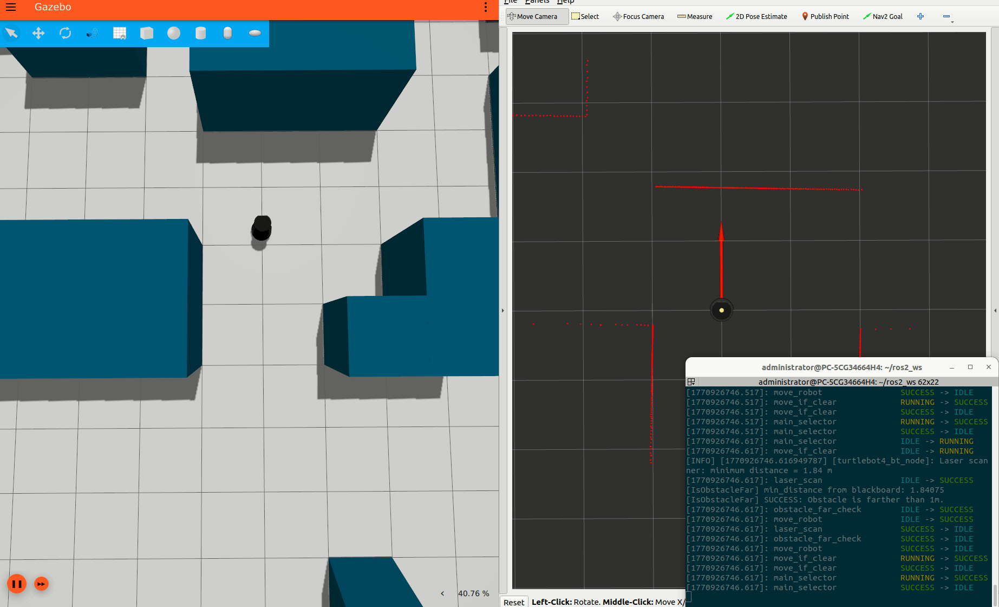
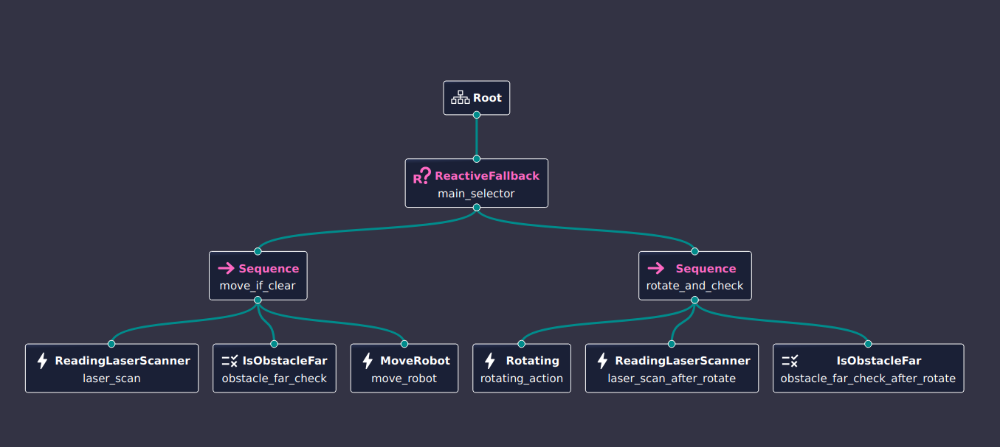

# ROS2 Behavior Tree for TurtleBot4

This package implements a simple obstacle avoidance and navigation behavior for TurtleBot4 using BehaviorTree.CPP and ROS2. The robot uses its LIDAR to detect obstacles and either moves forward or rotates to find a clear path.


## Overview

- **BehaviorTree.CPP v3** integration with ROS2
- Custom nodes for LIDAR scan, obstacle checking, movement, and rotation
- XML-based behavior tree configuration
- Designed for both simulation and real TurtleBot4 robots

## Behavior Tree Structure

The main behavior tree is defined in `config/turtlebot4_bt.xml`:

*Behavior Tree implementation visualized in Groot2*

```
MainTree (ReactiveFallback)
├── move_if_clear (Sequence)
│   ├── ReadingLaserScanner (updates min_distance)
│   ├── IsObstacleFar (checks if min_distance > 1.0m)
│   └── MoveRobot (moves forward)
└── rotate_and_check (Sequence)
    ├── Rotating (rotates robot 90°)
    ├── ReadingLaserScanner (updates min_distance)
    └── IsObstacleFar (checks if min_distance > 1.0m)
```

- The robot moves forward if the path ahead is clear (no obstacle within 1 meter).
- If an obstacle is detected within 1 meter, the robot rotates 90° and checks again.
- This process repeats, allowing the robot to navigate around obstacles.

## Custom Nodes

- **ReadingLaserScanner**: Reads `/scan` topic, finds the minimum distance in a ±20° window in front of the robot (aligned with the red axis/+Y direction), and writes it to the blackboard as `min_distance`.
- **IsObstacleFar**: Checks if `min_distance` is greater than 1.0 meter. Returns SUCCESS if clear, FAILURE if an obstacle is too close.
- **MoveRobot**: Publishes a forward velocity to `/cmd_vel` if the path is clear.
- **Rotating**: Rotates the robot by a specified angle (default 90°) to search for a clear path.

## Usage

### 1. Build the Package

```bash
cd ~/ros2_ws
colcon build --packages-select ros2_bt_turtlebot4
source install/setup.bash
```

### 2. Launch Simulation (optional)

```bash
ros2 launch turtlebot4_ignition_bringup turtlebot4_ignition.launch.py rviz:=true world:=maze
```

### 3. Run the Behavior Tree Node

```bash
ros2 run ros2_bt_turtlebot4 turtlebot4_bt_node
```

## Configuration

- The behavior tree XML is located at `config/turtlebot4_bt.xml`.
- You can modify the obstacle distance threshold or rotation angle in the XML or C++ code as needed.


## References
- [BehaviorTree.CPP Documentation](https://www.behaviortree.dev/)
- [TurtleBot4 Documentation](https://turtlebot.github.io/turtlebot4-user-manual/)
