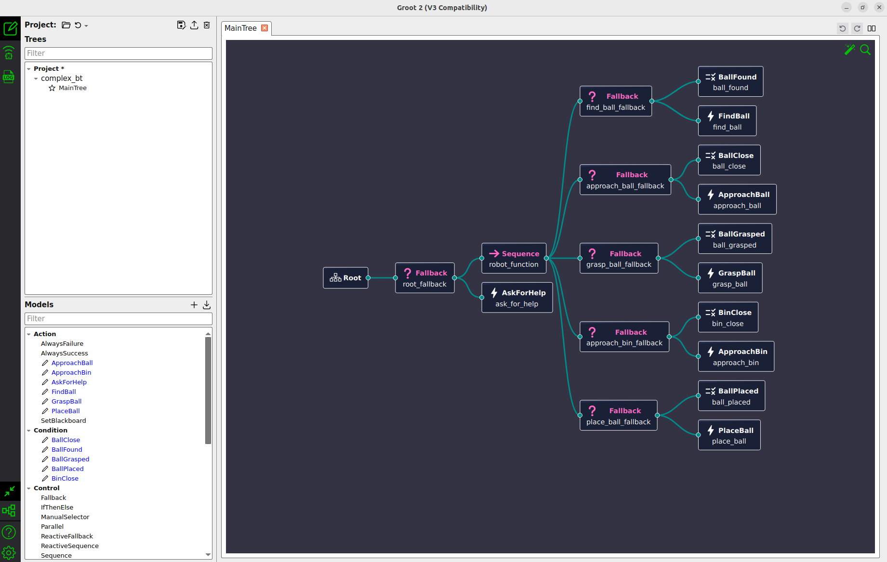

# Complex Behavior Tree Demo - Ball Grasp and Place
An advanced behavior tree implementation demonstrating a complete ball grasp-and-place robot task with fallback logic using [BehaviorTree.CPP](https://www.behaviortree.dev/).

## Overview

This demo implements a complex robot behavior tree that performs a complete pick-and-place operation with error recovery. The robot will:
1. **Find a ball** - Locate the ball in the environment
2. **Approach the ball** - Navigate to the ball's location
3. **Grasp the ball** - Pick up the ball with the gripper
4. **Approach the bin** - Navigate to the target bin
5. **Place the ball** - Drop the ball into the bin
6. **Ask for help** - If any step fails, request human assistance

## Behavior Tree Structure


*Behavior Tree implementation visualized in Groot2*

The tree uses a hierarchical structure with **Fallback** (?) and **Sequence** (→) control nodes to implement robust error handling.

### Main Structure:
- **Root Fallback** - Top-level fallback that tries the main sequence or asks for help
  - **Robot Function Sequence** - Sequential execution of all subtasks
    - **Find Ball Fallback** - Check if ball found, otherwise find it
    - **Approach Ball Fallback** - Check if ball close, otherwise approach it
    - **Grasp Ball Fallback** - Check if ball grasped, otherwise grasp it
    - **Approach Bin Fallback** - Check if bin close, otherwise approach it
    - **Place Ball Fallback** - Check if ball placed, otherwise place it
  - **Ask For Help** - Executed if main sequence fails

### Nodes:

**Conditions:**
- **BallFound** - Check if ball is detected
- **BallClose** - Check if ball is within reach
- **BallGrasped** - Check if ball is currently held
- **BinClose** - Check if bin is within reach
- **BallPlaced** - Check if ball is successfully placed

**Actions:**
- **FindBall** - Search and locate the ball (outputs ball_location)
- **ApproachBall** - Navigate to ball location (inputs ball_location)
- **GraspBall** - Close gripper to pick up ball
- **ApproachBin** - Navigate to bin location
- **PlaceBall** - Open gripper to release ball
- **AskForHelp** - Request human assistance (10 second wait)

### Blackboard Communication:
The tree uses blackboard variables for data sharing:
- `{location}` - Stores ball location coordinates passed from FindBall to ApproachBall

## Architecture

1. **CPP file** (`complex_bt.cpp`) - Behavior tree functionality and node implementations
2. **XML file** (`complex_bt.xml`) - Behavior tree design/structure
3. **CMakeLists.txt** - C++ build configuration

## Building

### For BehaviorTree.CPP V3:
```bash
cd complex_bt
mkdir build && cd build
cmake ..
make
```

### For BehaviorTree.CPP V4:
Update CMakeLists.txt to use C++17:
```cmake
set(CMAKE_CXX_STANDARD 17)
```

Then build:
```bash
cd complex_bt
mkdir build && cd build
cmake ..
make
```

## Running

```bash
./complex_bt
```

### Expected Output:
```
Ball not found
Ball Found
1 2 3 That's far away
1 2 3 Ball Approached
Ball not grasped
Ball grasped
Bin not close
Bin approached
Ball not placed
Bin approached
```

## Visualization with Groot2

To visualize this behavior tree in real-time:

1. Download and run [Groot2](https://www.behaviortree.dev/groot)
2. Start the `complex_bt` executable
3. In Groot2:
   - Click **Monitor** tab
   - Click **Connect** (connects to localhost:5555 by default)
   - Watch the tree execute in real-time with port data flow

Or simply load the XML file:
- Click **Editor** tab
- Click **Load** and select `complex_bt.xml`
- View the tree structure with all nodes and connections

## Key Features

- **Fallback Logic**: Each subtask checks if already complete before executing
- **Port Communication**: Ball location data flows between nodes via blackboard
- **Error Recovery**: If main sequence fails, robot asks for help
- **Real-time Monitoring**: ZMQ publisher enables Groot2 visualization

## Files

- `complex_bt.cpp` - Main implementation with node definitions
- `complex_bt.xml` - Behavior tree structure definition
- `CMakeLists.txt` - Build configuration

## Technologies

- **BehaviorTree.CPP v4** - Behavior tree library
- **C++17** - Programming language
- **ZMQ** - For Groot2 real-time monitoring
- **std::bind** - For function binding with simple conditions

## Reference

This implementation is inspired by the tutorial from [The Hummingbird - Robotics Demos](https://github.com/thehummingbird/robotics_demos/tree/main/behavior_trees/grasp_place_robot_demo).
