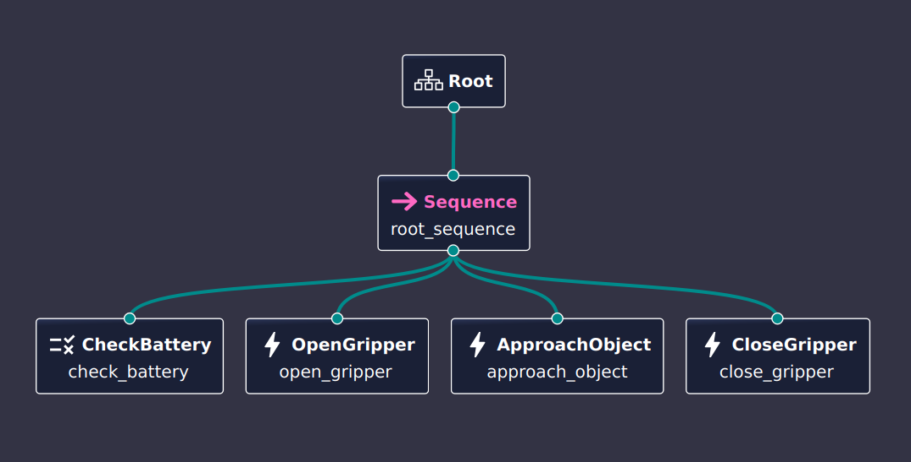

# Simple Behavior Tree Demo - Pick and Place

A basic behavior tree implementation demonstrating a simple pick-and-place robot sequence using [BehaviorTree.CPP](https://www.behaviortree.dev/).

## Overview

This demo implements a simple robot behavior tree that performs the following sequence:
1. **Check Battery** - Verify battery status
2. **Open Gripper** - Open the gripper
3. **Approach Object** - Move to the object
4. **Close Gripper** - Close the gripper to grasp the object

## Behavior Tree Structure


*Behavior Tree implementation visualized in Groot2*

The tree uses a **Sequence** control node that executes each action in order. All actions must succeed for the sequence to complete successfully.

### Nodes:
- **CheckBattery** (Condition) - Returns SUCCESS if battery is OK
- **OpenGripper** (Action) - Opens the robot gripper
- **ApproachObject** (Action) - Moves robot to approach the object (5 second delay)
- **CloseGripper** (Action) - Closes the gripper to grasp

## Building

```bash
cd simple_bt
mkdir build && cd build
cmake ..
make
```

## Running

```bash
./simple_bt
```

### Expected Output:
```
Battery OK
Gripper Open
Approach Object: approach_object
Gripper Close
```

## Architecture Files

- `simple_bt.cpp` - Main implementation with node definitions
- `simple_bt.xml` - Behavior tree structure definition
- `CMakeLists.txt` - Build configuration

## Technologies

- **BehaviorTree.CPP v3** - Behavior tree library
- **C++14** - Programming language
